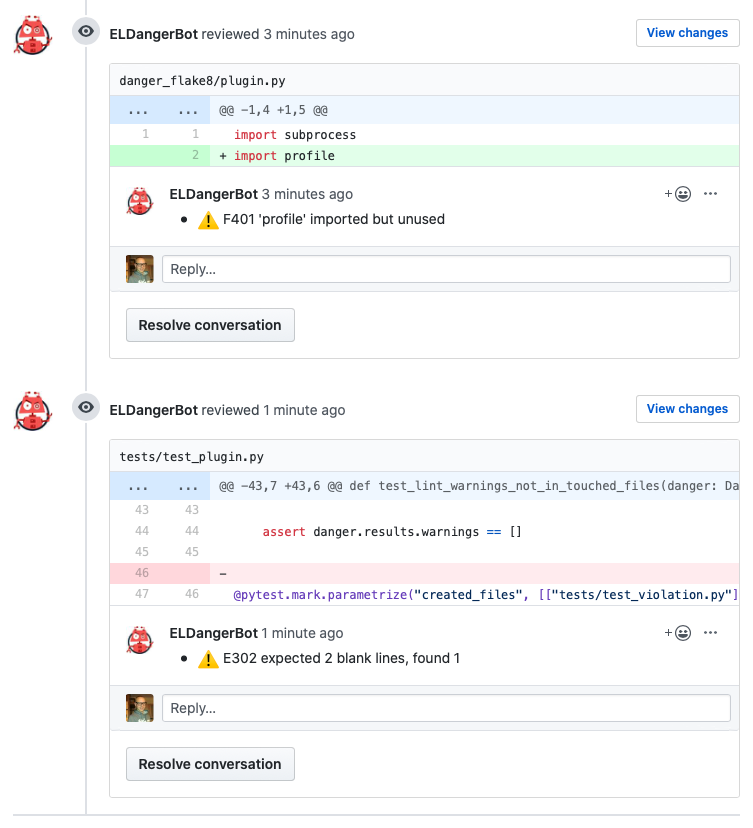

# danger-flake8

Danger python plugin for displaying flake8 lint results

<h3 align="center">
  <a href="https://www.elpassion.com">
    
  </a>
</h3>

## Example output



## Installation

```sh
# install danger-js
npm install -g danger
# install danger-python
pip install danger-python
# install danger-flake8
pip install git+https://github.com/elpassion/danger-flake8
# modify dangerfile.py to include plugin
# run danger-python on CI
danger-python ci
```

Add following to the `dangerfile.py`:

```python
import danger_flake8

danger_flake8.lint()
```

## License

`danger-flake8` is released under an MIT license. See [LICENSE](https://github.com/elpassion/danger-py-cov/blob/master/LICENSE) for more information.

